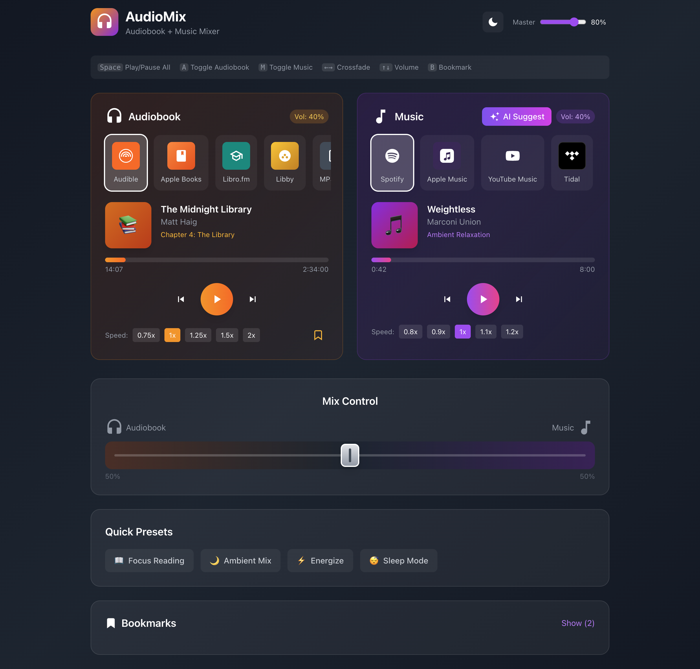

# AudioMix

A dual audio mixer prototype for simultaneously playing audiobooks and music, featuring AI-powered music suggestions and DJ-style mixing controls.



## Overview

AudioMix allows you to listen to audiobooks while playing background music, with intuitive controls to blend the two audio sources. Perfect for readers who enjoy ambient music while immersed in a story.

## Features

### Dual Audio Sources

**Audiobook Inputs**
- Audible
- Apple Books
- Libro.fm
- Libby (free library audiobooks)
- Local MP3 files

**Music Inputs**
- Spotify
- Apple Music
- YouTube Music
- Tidal
- Amazon Music
- SoundCloud
- Local MP3 files

### DJ-Style Crossfader

A single slider control to seamlessly blend between audiobook and music volume—slide left for more audiobook, slide right for more music. Real-time volume percentage indicators show the current mix.

### Full Transport Controls

- Play/pause for both audio sources
- Skip forward/back (30 seconds for audiobooks, 10 seconds for music)
- Scrubable progress bars with time display
- Playback speed control:
  - Audiobook: 0.75x, 1x, 1.25x, 1.5x, 2x
  - Music: 0.8x, 0.9x, 1x, 1.1x, 1.2x

### AI Music Suggestions

Click "AI Suggest" to analyze the current audiobook chapter and generate a curated playlist that matches the story's mood and themes.

**How it works:**
1. AI analyzes the chapter's mood, themes, and pacing
2. Generates a playlist of 6-8 songs from your selected music service
3. Displays analysis summary (mood, tempo, description)

**Playlist features:**
- Click any song to play
- Loop single song toggle
- Shuffle mode
- Auto-advances to next track
- Thumbs up/down feedback on songs
- Disliked songs are skipped automatically

**User Preferences:**
- Instrumental only toggle (on by default)
- Preferred genres selection (Ambient, Neo-classical, Piano ambient, Cinematic, Electronic, Downtempo, Post-rock)
- Re-analyze with updated preferences

### Quick Presets

One-click presets to instantly set the perfect mix:

| Preset | Description |
|--------|-------------|
| 📖 Focus Reading | Audiobook louder (75/25 mix) |
| 🌙 Ambient Mix | Balanced blend (50/50 mix) |
| ⚡ Energize | More music energy (40/60 mix) |
| 😴 Sleep Mode | Gentle mix with slower music |

### Bookmarking

- Add bookmarks at any point in the audiobook
- View, jump to, or delete saved bookmarks
- Each bookmark stores timestamp and chapter info

### Sleep Timer

Set a timer to automatically stop playback:
- Options: 15, 30, 45, 60, 90, or 120 minutes
- Countdown display in header
- Stops both audio sources when timer ends

### Keyboard Shortcuts

| Key | Action |
|-----|--------|
| `Space` | Play/pause both sources |
| `A` | Toggle audiobook playback |
| `M` | Toggle music playback |
| `←` / `→` | Adjust crossfader |
| `↑` / `↓` | Adjust master volume |
| `B` | Add bookmark |

## Tech Stack

- React 18
- Tailwind CSS
- SVG icons (Simple Icons for brand logos)

## Getting Started

### Prerequisites

- Node.js 18+
- npm or yarn

### Installation

```bash
# Clone the repository
git clone https://github.com/yourusername/audiomix.git
cd audiomix

# Install dependencies
npm install

# Start development server
npm run dev
```

### Using Vite (Recommended)

```bash
# Create new Vite project
npm create vite@latest audiomix -- --template react

# Navigate to project
cd audiomix

# Install Tailwind CSS
npm install -D tailwindcss postcss autoprefixer
npx tailwindcss init -p

# Copy the component file
# Replace src/App.jsx with audiobook-mixer.jsx content

# Start dev server
npm run dev
```

### Tailwind Configuration

Update `tailwind.config.js`:

```js
export default {
  content: ["./index.html", "./src/**/*.{js,jsx}"],
  theme: { extend: {} },
  plugins: [],
}
```

Add to `src/index.css`:

```css
@tailwind base;
@tailwind components;
@tailwind utilities;
```

## Project Status

This is a **UI prototype** demonstrating the concept and user experience. Current implementation includes:

- ✅ Full UI/UX design
- ✅ Simulated playback controls
- ✅ AI suggestion interface (simulated analysis)
- ✅ All user interactions and state management
- ⬜ Actual audio playback integration
- ⬜ Real API connections to streaming services
- ⬜ Backend for AI analysis

## Future Enhancements

- Real audio playback using Web Audio API
- OAuth integration with Spotify, Apple Music, etc.
- Actual AI/ML model for chapter mood analysis
- Cloud sync for bookmarks and preferences
- Mobile app (React Native)
- Audio ducking (auto-lower music during dialogue)
- EQ controls for music layer

## License

MIT License - feel free to use this prototype for your own projects.

## Acknowledgments

- Brand icons from [Simple Icons](https://simpleicons.org/)
- UI inspired by modern audio player designs